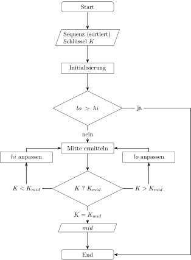
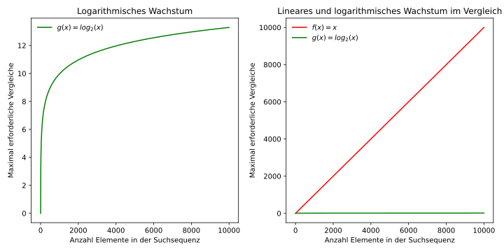

## Vorbereitungen

Als Vorbereitung für die Aufgaben in diesem Arbeitsblatt wird in der
folgenden Zelle die erforderliche Python Library `random` geladen.


```python
import random
```

# Binary Searech

In diesem Notzibuch sollen zwei Suchalgorithmen einander gegenüber
gestellt werden.

## Lineare Suche

*Kommentar für die Lehrperson*  
Für die Einführung in die lineare Suche soll in einem gut gemischten
Spiel Jasskarten eine bestimmte Karte gesucht werden. Die Schülerinnen
und Schüler (SuS) sollen in Partnerarbeit diskutieren, wie viele Karten
Sie im durchschnitt und im schlechtesten Fall vom verdeckt aufliegenden
Stapel nehmen müssen, bis die gesuchte Karte gefunden wird.

*Ausgangslage für die Implementation*  
Gegeben sei eine Python Liste mit 16 Werten in beliebiger Reihenfolge.
Gesucht ist ein Verfahren, mit dem überprüft werden kann, ob ein
beliebiger Wert in dieser Python Liste vorkommt und wenn ja, mit welchem
Index. 

Die einfachste Lösung für dieses Problem ist es, ein Element nach dem
anderen auf seine Übereinstimmung mit dem gesuchten Wert zu überprüfen.
Wird das Element gefunden, wird der Index zurückgegeben, wird das
Element nicht gefunden -1.  
Das hier beschriebene Vorgehen heisst lineare Suche.  

In der Folge soll mit der hier gegebenen Python Liste `sequenz`
gearbeitet werden.  


```python
sequenz = [17, 35, 42, 24, 21, 36, 75, 34, 12, 35, 23, 69, 34, 28, 
           86, 98]
```

### Aufgabe zur Implementierung der linearen Suche

Implementieren Sie in der folgenden Zelle die lineare Suche als Funktion
in Python.  
Testen Sie Ihre Implementation mit den Werten 1, 17, 98 und 100 an der
Python Liste `sequenz`.


```python
def linear_search(seq, x):
    # TODO: Implementation ohne enumerate
    i = 1
    for value in seq:
        if value == x:
            break
        else:
            i += 1
    if i > len(seq):
        return -1
    else:
        return i - 1
```


```python
print(linear_search(sequenz, 1))
print(linear_search(sequenz, 17))
print(linear_search(sequenz, 98))
print(linear_search(sequenz, 100))
```

### Aufgabe 1 zur Effizienz der linearen Suche

Mit den folgenden Aufgaben soll aufgezeigt werden, wie es um die
Effizienz der linearen Suche steht.

Die Python Liste `sequenz` beinhaltet 16 zufällig gewählte natürliche
Zahlen von 1 bis 100.  
Wählen Sie 100 mal zufällig eine Zahl aus `sequenz` aus und 
suchen Sie mit Hilfe einer Schlaufe in `sequenz` nach diesen zufällig
gewählten Zahlen.   
Wie viele Vergleiche müssen Sie im Durchschnitt über diese 100
Suchdurchläufe vornehmen?


```python
search_values = [random.choice(sequenz) for i in range(100)]
```


```python
searches = []
for x in search_values:
    i = 0
    for v in sequenz:
        i += 1
        if x == v:
            break
    searches.append(i)
print(sum(searches)/len(searches))
```

### Aufgabe 2 zur Effizienz der linearen Suche

Wählen Sie zufällig 100 natürliche Zahlen von 1 bis 100 und 
suchen Sie mit Hilfe einer Schlaufe in `sequenz` nach diesen zufällig
gewählten Zahlen.   
Wie viele Vergleiche müssen Sie jetzt im Durchschnitt über diese 100
Suchdruchläufe vornehmen?


```python
search_values_100 = [random.randint(1,100) for i in range(100)]
```


```python
searches_100 = []
for x in search_values_100:
    i = 0
    for v in sequenz:
        i += 1
        if x == v:
            break
    searches_100.append(i)
print(sum(searches_100)/len(searches_100))
```

### Besprechung der Resultate

Die erste Aufgabe scheint ein Resultat in der Nähe von 8 zu liefern, die
zweite eines von etwas mehr als 14. Woran liegt das?

Wenn wir eine Zahl zufällig aus der Python Liste `sequenz` auswählen,
hat jede Position die Wahrscheinlichkeit von $\frac{1}{16}$. Es sind also
$\frac{8}{16}$ mit weniger als 8 Vergleichen und $\frac{8}{16}$ mit mehr
als 8 vergleichen. Damit kommen wir im Mittel auf 8 Vergleiche.  

Wenn jedoch eine Zahl von 1 bis 100 gewählt wird, ist die Chance,
dass sich die Zahl in der Python Liste `sequenz` findet, nur
$\frac{16}{100}$. $\frac{84}{100}$ mögliche Werte
liegen ausserhalb der Pyhton Liste `sequenz`. Damit werden in
$\frac{84}{100}$ aller Fälle 16 Vergleiche erforderlich.

Daraus ergibt sich folgende Rechnung für den Gesamtdurchschnitt:

$$
\small
8 \times 0.16 + 16 \times 0.84 = 14.72
$$

Im Mittel braucht es bei der gegebenen Ausgangslage also etwas mehr als
14 Vergleiche.  
Im schlimmsten Fall - wenn der gesuchte Wert nicht in der Python Liste
`sequenz` zu finden ist - braucht die lineare Suche allerdings 16
Vergleiche.   
Verallgemeinert bedeutet das, dass der Aufwand linear zur Länge der zu
durchsuchenden Sequenz wächst.

Vor diesem Hintergrund lohnt sich die Suche nach einem Verfahren,
welches auch im schlimmsten Fall weniger Vergleiche erfordert. Ein
solches Verfahren ist die binäre Suche.

## Binäre Suche

*Kommentar für die Lehrperson*  
Das Suchbeispiel mit den Jasskarten kann mit einem sortierten Spiel
fortgesetzt werden. Die SuS sollen in einer Gruppe diskutieren, wie am
effizientesten nach einer Bestimmten Karte in einem sortierten Spiel
gesucht wird. Vor dem Hintergrund der Besprechung der gewonnenen
Erkenntnisse können dann die folgenden Aufgaben gelöst werden.

Eine erste Verbesserung der Effizienz der Suche ergibt sich, wenn die zu
durchsuchende Sequenz in aufsteigender Reihenfolge sortiert ist. In der
folgenden Zelle wird eine sortierte Kopie `sequenz_sortiert` von
`sequenz` erstellt.


```python
sequenz_sortiert = sequenz.copy()
sequenz_sortiert.sort()
```


    [12, 17, 21, 23, 24, 28, 34, 34, 35, 35, 36, 42, 69, 75, 86, 98]


### Aufgabe

Wie kann mit möglichst wenigen Vergleichen überprüft werden, ob ein Wert
im Bereich der Python Liste `sequenz_sortiert` liegt?  
Überprüfen Sie Ihre Implementation mit den Werten 10, 12, 98 und 100.


```python
def in_range(seq, x):
    if x < seq[0] or x > seq[-1]:
        return -1
    else:
        return 1
```


```python
print(in_range(sequenz_sortiert, 10))
print(in_range(sequenz_sortiert, 12))
print(in_range(sequenz_sortiert, 98))
print(in_range(sequenz_sortiert, 100))
```

### Aufgabe

Entwerfen Sie basierend auf dem Konzept von *divide and conquer* einen
Algorithmus für die Suche in einer geordneten Sequenz in dem Sie das
Grundproblem in kleinere Teilprobleme zerlegen. Denken Sie dabei daran,
allfällige Zufallslösungen nicht zu verschwenden.

Eine graphische Lösung kann folgendermassen aussehen:  


Oder in formaler mathematischer Schreibweise:

$$
\footnotesize
\text{BinarySearch}(A, x, \text{low}, \text{high}) = 
\left\{
    \begin{array}{lll}
        -1, & \text{high} < \text{low} & \text{Basisfall 1}\\
        \text{mid}, & A[\text{mid}] = x & \text{Basisfall 2}\\
        \text{BinarySearch}(A, x, \text{low}, \text{mid} - 1), 
        & x < A[\text{mid}] & \text{Rekursionsfall links}\\
        \text{BinarySearch}(A, x, \text{mid} + 1, \text{high}), 
        & x > A[\text{mid}] & \text{Rekursionsfall rechts} \\
    \end{array}
\right.
$$

Wobei $A$ eine sortierte Python Liste (dynamisches Array), $x$ der gesuchte Wert, $low$ der
Anfangsindex und $high$ der Endindex des Suchbereichs ist. Der Index
$mid$ wird als $\lfloor (\text{low} + \text{high}) / 2 \rfloor$
berechnet.

### Aufgabe

Implementieren Sie die binäre Suche als Funktion in Python so, wie sie mathematisch formal
dargestellt worden ist.  
Überprüfen Sie auch diese Implementation mit den Werten 10, 12, 98 und 100.


```python
def binary_search(seq, x, lo=0, hi=None):
    if hi is None:
        hi = len(seq) - 1
        
    mid = (lo + hi) // 2
        
    if hi < lo:
        return -1
    elif seq[mid] == x:
        return mid
    elif x < seq[mid]:
        return binary_search(seq, x, lo, mid-1)
    else:
        return binary_search(seq, x, mid+1, hi)
```


```python
print(binary_search(sequenz_sortiert, 10))
print(binary_search(sequenz_sortiert, 12))
print(binary_search(sequenz_sortiert, 98))
print(binary_search(sequenz_sortiert, 100))
```

    -1
    0
    15
    -1
    

### Aufgabe

Wie viele Vergleiche erfordert die binäre Suche in der Python Liste
`sequenz_sortiert` für die Werte 10, 12, 98 und 100?

Um besser Zählen zu können, können die einzelnen Schritte beim
Durchlaufen der Funktion `binary_search()` als Tabelle dargestellt
werden.

Tabelle für den gesuchten Wert 10:

|Vergleich Nr.|low|high|mid|Vergleichswert|
| ---: | ---: | ---: | ---: | ---: |
|1            |  0|  15|  7|   34|
|2            |  0|   6|  3|   23|
|3            |  0|   2|  1|   17|
|4            |  0|   0|  0|   12|

Tabelle für den gesuchten Wert 12:

|Vergleich Nr.|low|high|mid|Vergleichswert|
| ---: | ---: | ---: | ---: | ---: |
|1            |  0|  15|  7|   34|
|2            |  0|   6|  3|   23|
|3            |  0|   2|  1|   17|
|4            |  0|   0|  0|   12|

Tabelle für den gesuchten Wert 98:

|Vergleich Nr.|low|high|mid|Vergleichswert|
| ---: | ---: | ---: | ---: | ---: |
|1            |  0|  15|  7|   34|
|2            |  8|  15| 11|   42|
|3            | 12|  15| 13|   75|
|4            | 14|  15| 14|   86|
|5            | 15|  15| 15|   98|

Tabelle für den gesuchten Wert 100:

|Vergleich Nr.|low|high|mid|Vergleichswert|
| ---: | ---: | ---: | ---: | ---: |
|1            |  0|  15|  7|   34|
|2            |  8|  15| 11|   42|
|3            | 12|  15| 13|   75|
|4            | 14|  15| 14|   86|
|5            | 15|  15| 15|   98|


Durch ausprobieren kommt man im Maximum auf 5 Vergleiche.

### Aufgabe

In welcher Beziehung steht die Zahl 5 zur Zahl 16? Eine Hilfe ergibt
sich möglicherweise aus der Information, dass bei einer Sequenz mit 8
Elementen im Maximum 4 Vergleiche und bei einer solchen mit 32 Elementen
6 Vergleiche erforderlich sind.


5 ist gleich $log_2(16) + 1$. Es scheint, als brauche es im Maximum $log_2(n) + 1$ Vergleiche.

### Induktive Herleitung des Resultates

Mit der binären Suche soll in einer aufsteigend sortierten Sequenz der
Länge $n$ ein besetimmtes Element gefunden werden.

Die Suche nach dem Element beginnt in der Mitte der gegebenen Sequenz.  

Falls das gesuchte Element mit dem Element in der Mitte der Sequenz
übereinstimmt, wurde das gesuchte Element gefunden und die Suche endet.  
Ist das gesuchte Element kleiner als das mittlere Element, muss das
gesuchte Element in der linken
Hälfte gesucht werden. Ist das gesuchte Element grösser als das mittlere
Element, muss in der rechten Hälfte weitergesucht werden. In beiden
Fällen reduziert sich das Problem auf die Hälfte seiner ursprünglichen
Grösse.  

Das Problem wird bei jedem Vergleich halbiert, bis entweder das gesuchte
Element gefunden worden ist, oder kein Element zum vergleichen mehr
übrig ist. Im schlimmsten Fall sind $log_2(n) + 1$ Schritte erforderlich,
um festzustellen, dass das gesuchte Element in der gegebenen Sequenz
nicht vorkommt.  

Das bedeutet, dass der Aufwand für die Suche sehr viel langsamer wächst,
als die Anzahl der Elemente in einer zu durchsuchenden Sequenz.

In der untenstehenden Grafik soll der Unterschied zwischen linearem und
logarithmischem Wachstum veranschaulicht werden.


